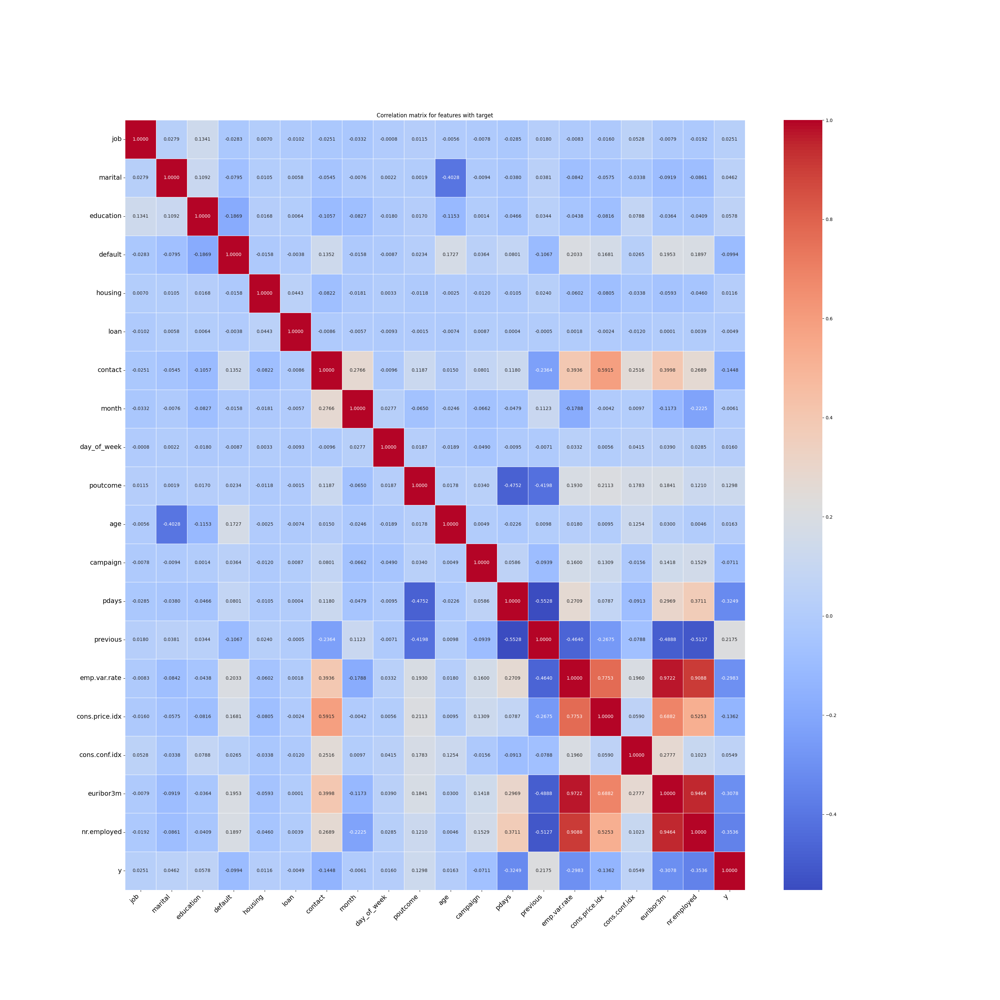
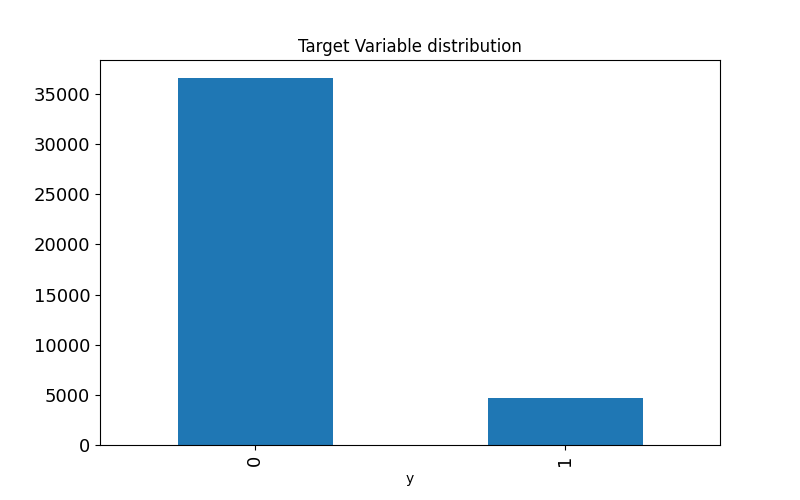
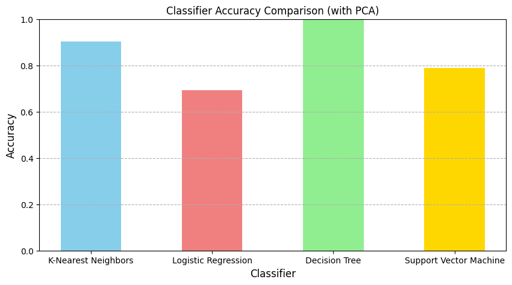

# Compare Classifiers

Berkeley AI/ML Assignment 17.1: Comparing Classifiers

[Juypter Notebook](https://github.com/hemant280/comparing-classifiers/blob/main/analysis.ipynb)

[Environment Details (requrement.txt)](https://github.com/hemant280/comparing-classifiers/requirement.txt)

**OVERVIEW**

In this third practical application assignment, your goal is to compare the performance of the classifiers (k-nearest neighbors, logistic regression, decision trees, and support vector machines) you encountered in this section of the program. You will use a dataset related to the marketing of bank products over the telephone.

Leveraging Business Intelligence and Data Mining techniques within the CRISP-DM methodology enhance the bank direct marketing campaigns by analyzing real bank data. 


The dataset that will be used is UC Irvine Machine Learning Repository. The data is from a Portuguese banking institution and is a collection of the results of multiple marketing campaigns. 

**Goal**

The goal is to create a predictive model to identify clients likely to subscribe to long-term deposits, thereby improving customer selection, optimizing resources, and increasing campaign success rates. 


**High level Approach**

Following steps taken to prepare and train model.
- Preprocessing numerical columns
- Preprocessing categorical columns
- Identify correlations
- Fixing the class imbalance using SMOTE
    - _Additional python library is required (imbalanced-learn) (check the requirement.txt)_
- Split the dataset for training and testing
- Principal Component Analysis (PCA) to reduce the feature count
- Training and Fiting the model (classifiers):
    - k-nearest neighbors 
    - logistic regression
    - decision trees
    - support vector machines
- Model Comparision
- Improving the Model
- Evaluation Report

<hr/>

### Data Preparation
**Summary of Data**

- Data Set Characteristics: Multivariate
- Attribute Characteristics: Real
- Number of Instances: 41188
- Number of Input Attributes: 20
- Number of Output Attribute: 1
- Missing Values: No

**Additional Information about data**

**Input variables:**
- #### bank client data:
    1. age (numeric)
    2. job : type of job (categorical: 'admin.','blue-collar','entrepreneur','housemaid','management','retired','self-employed','services','student','technician','unemployed','unknown')
    3. marital : marital status (categorical: 'divorced','married','single','unknown'; note: 'divorced' means divorced or widowed)
    4.  education (categorical: 'basic.4y','basic.6y','basic.9y','high.school','illiterate','professional.course','university.degree','unknown')
    5. default: has credit in default? (categorical: 'no','yes','unknown')
    6. housing: has housing loan? (categorical: 'no','yes','unknown')
    7. loan: has personal loan? (categorical: 'no','yes','unknown')
- #### related with the last contact of the current campaign:
    8. contact: contact communication type (categorical: 'cellular','telephone')
    9. month: last contact month of year (categorical: 'jan', 'feb', 'mar', ..., 'nov', 'dec')
    10. day_of_week: last contact day of the week (categorical: 'mon','tue','wed','thu','fri')
    11. duration: last contact duration, in seconds (numeric). Important note: this attribute highly affects the output target (e.g., if duration=0 then y='no'). Yet, the duration is not known before a call is performed. Also, after the end of the call y is obviously known. Thus, this input should only be included for benchmark purposes and should be discarded if the intention is to have a realistic predictive model.
- #### other attributes:
    12. campaign: number of contacts performed during this campaign and for this client (numeric, includes last contact)
    13. pdays: number of days that passed by after the client was last contacted from a previous campaign (numeric; 999 means client was not previously contacted)
    14. previous: number of contacts performed before this campaign and for this client (numeric)
    15. poutcome: outcome of the previous marketing campaign (categorical: 'failure','nonexistent','success')
- #### social and economic context attributes
    16. emp.var.rate: employment variation rate - quarterly indicator (numeric)
    17. cons.price.idx: consumer price index - monthly indicator (numeric)
    18. cons.conf.idx: consumer confidence index - monthly indicator (numeric)
    19. euribor3m: euribor 3 month rate - daily indicator (numeric)
    20. nr.employed: number of employees - quarterly indicator (numeric)

**Output variable (desired target):**
21. y - has the client subscribed a term deposit? (binary: 'yes','no')
<hr/>

**All Columns with % of missing values**
- age: 0.00% missing values
- job: 0.00% missing values
- marital: 0.00% missing values
- education: 0.00% missing values
- default: 0.00% missing values
- housing: 0.00% missing values
- loan: 0.00% missing values
- contact: 0.00% missing values
- month: 0.00% missing values
- day_of_week: 0.00% missing values
- duration: 0.00% missing values
- campaign: 0.00% missing values
- pdays: 0.00% missing values
- previous: 0.00% missing values
- poutcome: 0.00% missing values
- emp.var.rate: 0.00% missing values
- cons.price.idx: 0.00% missing values
- cons.conf.idx: 0.00% missing values
- euribor3m: 0.00% missing values
- nr.employed: 0.00% missing values
- y: 0.00% missing values

#### Preprocessing numerical columns: Identify the numerical columns and their distributions.
- We will drop 'duration' column per the dataset information
```
<class 'pandas.core.frame.DataFrame'>
RangeIndex: 41188 entries, 0 to 41187
Data columns (total 10 columns):
 #   Column          Non-Null Count  Dtype  
---  ------          --------------  -----  
 0   age             41188 non-null  int64  
 1   duration        41188 non-null  int64  
 2   campaign        41188 non-null  int64  
 3   pdays           41188 non-null  int64  
 4   previous        41188 non-null  int64  
 5   emp.var.rate    41188 non-null  float64
 6   cons.price.idx  41188 non-null  float64
 7   cons.conf.idx   41188 non-null  float64
 8   euribor3m       41188 non-null  float64
 9   nr.employed     41188 non-null  float64
dtypes: float64(5), int64(5)
```

#### Preprocessing numerical columns: 

Identify outlines and skewed data 

**plot the data**  
 - For all columns in numerical columns
    - col 1: box-plot
    - col 2: histogram
    - col 3: Q-Q graph

Based on the graph 
- Look like there is a single outlier in field: cons.conf.idx column
    
- Values in field age, campaign and previous are right-skewed
    
    
    
- Value in field nr.employeed is left-skewed
    

Reduce the skewness before scaling. We will apply transformations to the dataset. We are using x² (for left skewed) and sqrt transformations (for right skewed).

- Field age, campaign and previous after transformation
    
    
    
- Field nr.employeed after transformation
    

#### Preprocessing categorical columns: Identify the categorical columns and their distributions.
```
<class 'pandas.core.frame.DataFrame'>
RangeIndex: 41188 entries, 0 to 41187
Data columns (total 11 columns):
 #   Column       Non-Null Count  Dtype 
---  ------       --------------  ----- 
 0   job          41188 non-null  object
 1   marital      41188 non-null  object
 2   education    41188 non-null  object
 3   default      41188 non-null  object
 4   housing      41188 non-null  object
 5   loan         41188 non-null  object
 6   contact      41188 non-null  object
 7   month        41188 non-null  object
 8   day_of_week  41188 non-null  object
 9   poutcome     41188 non-null  object
 10  y            41188 non-null  object
dtypes: object(11)
```
Identify uniq values for categorical columns 

- contact: cellular, telephone
- day_of_week: thu, mon, wed, tue, fri
- default: no, unknown, yes
- education: university.degree, high.school, basic.9y, professional.course, basic.4y, basic.6y, unknown, illiterate
- housing: yes, no, unknown
- job: admin., blue-collar, technician, services, management, retired, entrepreneur, self-employed, housemaid, unemployed, student, unknown
- loan: no, yes, unknown
- marital: married, single, divorced, unknown
- month: may, jul, aug, jun, nov, apr, oct, sep, mar, dec
- poutcome: nonexistent, failure, success
- y: no, yes


Converting pdays to categorical variable as Contacted or Not contacted previously.

Using label encoding for all the categorical columns

Merging part_1 and part_2 data frame
```
<class 'pandas.core.frame.DataFrame'>
RangeIndex: 41188 entries, 0 to 41187
Data columns (total 20 columns):
 #   Column          Non-Null Count  Dtype  
---  ------          --------------  -----  
 0   job             41188 non-null  int8   
 1   marital         41188 non-null  int8   
 2   education       41188 non-null  int8   
 3   default         41188 non-null  int8   
 4   housing         41188 non-null  int8   
 5   loan            41188 non-null  int8   
 6   contact         41188 non-null  int8   
 7   month           41188 non-null  int8   
 8   day_of_week     41188 non-null  int8   
 9   poutcome        41188 non-null  int8   
 10  y               41188 non-null  int8   
 11  age             41188 non-null  float64
 12  campaign        41188 non-null  float64
 13  pdays           41188 non-null  int64  
 14  previous        41188 non-null  float64
 15  emp.var.rate    41188 non-null  float64
 16  cons.price.idx  41188 non-null  float64
 17  cons.conf.idx   41188 non-null  float64
 18  euribor3m       41188 non-null  float64
 19  nr.employed     41188 non-null  float64
dtypes: float64(8), int64(1), int8(11)
memory usage: 3.3 MB
```

#### Identify correlations



Using 0.8 as a threshold for what I consider a "high" correlation

- ('euribor3m', 'emp.var.rate', 0.9722), 
- ('nr.employed', 'emp.var.rate', 0.9088), 
- ('nr.employed', 'euribor3m', 0.9464)

We will drop euribor3m, emp.var.rate and nr.employed variables from future dataframe

```
<class 'pandas.core.frame.DataFrame'>
RangeIndex: 41188 entries, 0 to 41187
Data columns (total 16 columns):
 #   Column          Non-Null Count  Dtype  
---  ------          --------------  -----  
 0   job             41188 non-null  int8   
 1   marital         41188 non-null  int8   
 2   education       41188 non-null  int8   
 3   default         41188 non-null  int8   
 4   housing         41188 non-null  int8   
 5   loan            41188 non-null  int8   
 6   contact         41188 non-null  int8   
 7   month           41188 non-null  int8   
 8   day_of_week     41188 non-null  int8   
 9   poutcome        41188 non-null  int8   
 10  age             41188 non-null  float64
 11  campaign        41188 non-null  float64
 12  pdays           41188 non-null  int64  
 13  previous        41188 non-null  float64
 14  cons.price.idx  41188 non-null  float64
 15  cons.conf.idx   41188 non-null  float64
dtypes: float64(5), int64(1), int8(10)
```

**Plot Target variable distribution**




### Split the dataset for training and testing
- Address Data Imbalance using SMOTE
    - Shape of: (Training Dataset before and after SMOTE)
        - x_train before: (32950, 19)
        - y_train before: (32950, 1)
        - x_train after: (58538, 19)
        - y_train after: (58538, 1)
    - Balance of positive and negative classes (%): y
        - y=0, 50.0%
        - y=1, 50.0%
    - Target Variable distribution after SMOTE
    

### Principal Component Analysis (PCA) to reduce the feature count

We want to reduce the dimensionality, we will use Principal Component Analysis to get the principal components and reduce the dimensionality

- Standardize features before PCA, as it is sensitive to the scale of the data.
- Calculate the number of components to explain 95% variance
    - Number of components to capture 95% variance: 14
    
    - Top contributing features for each principal component:
        - PC1: ['contact', 'cons.price.idx', 'previous', 'poutcome', 'default']
        - PC2: ['poutcome', 'pdays', 'cons.conf.idx', 'marital', 'age']
        - PC3: ['age', 'pdays', 'marital', 'previous', 'education']
        - PC4: ['month', 'contact', 'poutcome', 'previous', 'age']
        - PC5: ['job', 'cons.conf.idx', 'campaign', 'education', 'pdays']
        - PC6: ['day_of_week', 'campaign', 'education', 'job', 'housing']
        - PC7: ['loan', 'housing', 'day_of_week', 'month', 'contact']
        - PC8: ['job', 'default', 'marital', 'day_of_week', 'housing']
        - PC9: ['housing', 'loan', 'day_of_week', 'month', 'job']
        - PC10: ['campaign', 'day_of_week', 'default', 'job', 'housing']
        - PC11: ['cons.conf.idx', 'marital', 'job', 'default', 'cons.price.idx']
        - PC12: ['education', 'cons.price.idx', 'month', 'campaign', 'job']
        - PC13: ['education', 'default', 'month', 'cons.price.idx', 'cons.conf.idx']
        - PC14: ['age', 'marital', 'default', 'cons.conf.idx', 'cons.price.idx'] 

### Training and Fiting the model (classifiers):

Summary of Classifier Performance:
| Model | Train Time (s) | Train Accuracy | Test Accuracy |
| ----- | ---------- | -------------  | -----------   |
| K-Nearest Neighbors | 0.0246 | 0.9033 | 0.5307 |
| Logistic Regression | 0.0396 | 0.6926 | 0.5276 |
| Decision Tree | 1.3915 | 0.9962 | 0.5806 |
| Support Vector Machine | 39.0779 | 0.7891 | 0.4959 |



Model Comarision with training times 


### Model Comparision
The 'Decision Tree' classifiers perfrmes for this dataset with training accuracy of 0.9962 and training time of 1.39 seconds, across other classifiers such as K-Nearest Neighbors, Logistic Regression, Support Vector Machine

### Improving the Model
- Remove features to determine impact
    Based on top contributing features for each principal componentthe removing day_of_week or housing will not have impact to the performance of the classifiers

- Tune hyper parameters 
    Defined the pipeline with a placeholder for the classifier, included PCA as a step, so it will be correctly handled by GridSearchCV, tried with different number of components considering the compute (limited to max 3 component)

    Defined the hyperparameter grids for each classifier, the default parameters are set to avoid linter errors, the classifier values will be replaced in the param_grids

    ```
    param_grids = {
        'K-Nearest Neighbors': {
            'pca__n_components': pca_components_to_try,
            'classifier': [KNeighborsClassifier(n_neighbors=5)],
            'classifier__n_neighbors': [3, 5, 7, 9],
            'classifier__weights': ['uniform', 'distance']
        },
        'Logistic Regression': {
            'pca__n_components': pca_components_to_try,
            'classifier': [LogisticRegression(solver='liblinear', random_state=42)],
            'classifier__C': [0.1, 1, 10],
            'classifier__penalty': ['l1', 'l2']
        },
        'Decision Tree': {
            'pca__n_components': pca_components_to_try,
            'classifier': [DecisionTreeClassifier(random_state=42,ccp_alpha=0.01)],
            'classifier__max_depth': [3, 5, 7, 10, None],
            'classifier__ccp_alpha': [0.0, 0.01, 0.1],
            'classifier__min_samples_split': [2, 5, 10]
        },
        'Support Vector Machine': {
            'pca__n_components': pca_components_to_try,
            'classifier': [SVC(random_state=42,gamma='scale', C=1.0, kernel='rbf')],
            'classifier__C': [0.1, 1, 10],
            'classifier__kernel': ['linear', 'rbf'],
            'classifier__gamma': ['scale', 'auto']
        }
    }
    ```
    #### GridSearchCV execution logs:
    <hr/>
- Running GridSearchCV for K-Nearest Neighbors...
    - Fitting 5 folds for each of 24 candidates, totalling 120 fits
    - Best parameters for K-Nearest Neighbors: {'classifier': KNeighborsClassifier(), 'classifier__n_neighbors': 3, 'classifier__weights': 'distance', 'pca__n_components': 3}
    - Best cross-validation accuracy for K-Nearest Neighbors: 0.6811
    <hr/>
- Running GridSearchCV for Logistic Regression...
    - Fitting 5 folds for each of 18 candidates, totalling 90 fits
    - Best parameters for Logistic Regression: {'classifier': LogisticRegression(random_state=42, solver='liblinear'), 'classifier__C': 0.1, 'classifier__penalty': 'l1', 'pca__n_components': 1}
    - Best cross-validation accuracy for Logistic Regression: 0.5073
    <hr/>
- Running GridSearchCV for Decision Tree
    - Fitting 5 folds for each of 45 candidates, totalling 225 fits
    - Best parameters for Decision Tree: {'classifier': DecisionTreeClassifier(random_state=42), 'classifier__max_depth': None, 'classifier__min_samples_split': 2, 'pca__n_components': 3}
    - Best cross-validation accuracy for Decision Tree: 0.6423
    <hr/>
- Running GridSearchCV for Support Vector Machine...
    - Fitting 5 folds for each of 36 candidates, totalling 180 fits
    - Best parameters for Support Vector Machine: {'classifier': SVC(random_state=42), 'classifier__C': 10, 'classifier__gamma': 'auto', 'classifier__kernel': 'rbf', 'pca__n_components': 3}
    - Best cross-validation accuracy for Support Vector Machine: 0.5086

    **Evaluating best estimators on the test set:**
    - Test accuracy for tuned K-Nearest Neighbors: 0.7050
    - Test accuracy for tuned Logistic Regression: 0.6787
    - Test accuracy for tuned Decision Tree: 0.6816
    - Test accuracy for tuned Support Vector Machine: 0.7521

## Model Evaluation Report: Bank Marketing Campaign Classifier Comparison

### Executive Summary

This report presents a comprehensive evaluation of four machine learning classifiers developed to predict customer subscription to long-term deposits for a Portuguese banking institution. The analysis compared K-Nearest Neighbors, Logistic Regression, Decision Trees, and Support Vector Machines using data from 17 marketing campaigns conducted between 2008-2010.

### Context and Objective
The Portuguese banking institution conducted direct marketing campaigns primarily through telephone calls to promote long-term deposit products with attractive interest rates. The business challenge was to improve campaign efficiency by better identifying customers likely to subscribe.

### Business Metrics
- **Dataset Size:** 41,188 customer contacts across 17 campaigns
- **Time Period:** May 2008 to November 2010
- **Baseline Success Rate:** 8% (6,499 successes out of 79,354 total contacts)
- **Business Goal:** Increase campaign success rates while optimizing resource allocation

### Success Criteria
The predictive model aims to:
1. Significantly exceed the 8% baseline success rate
2. Provide actionable customer segmentation insights
3. Optimize marketing resource allocation
4. Enable data-driven campaign targeting decisions

**Key Findings:**
- Support Vector Machine achieved the highest performance with 75.21% test accuracy after hyperparameter tuning
- Hyperparameter optimization significantly improved all models, with SVM showing the largest gain (25.62 percentage points)
- The baseline success rate of 8% was substantially improved across all models
- Economic context features showed high multicollinearity and were removed to improve model efficiency

**Recommendation:** Deploy the tuned SVM model for production use to optimize marketing campaign targeting and resource allocation.


